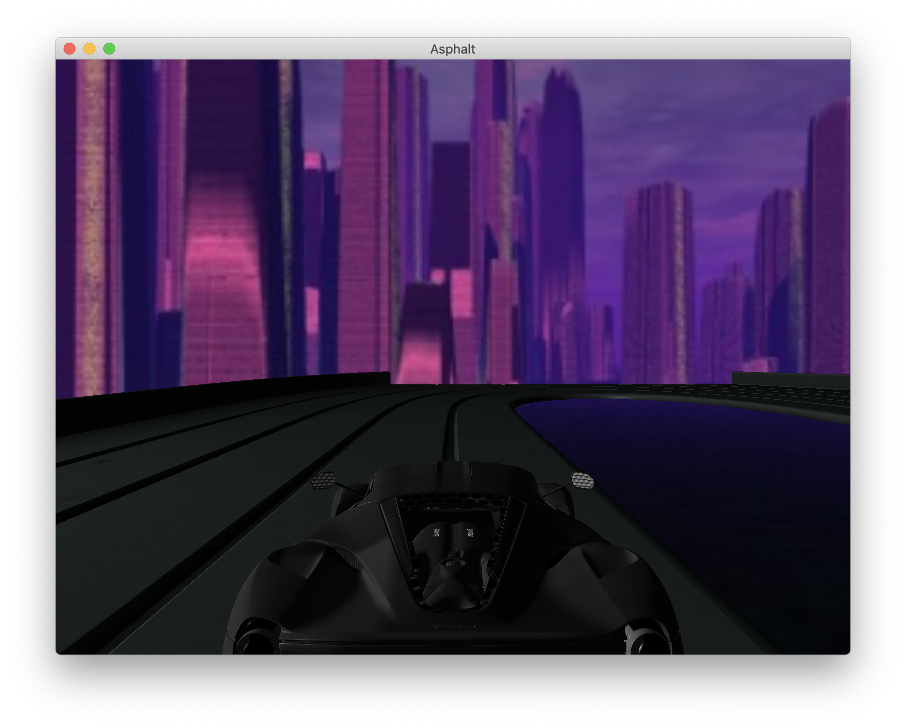
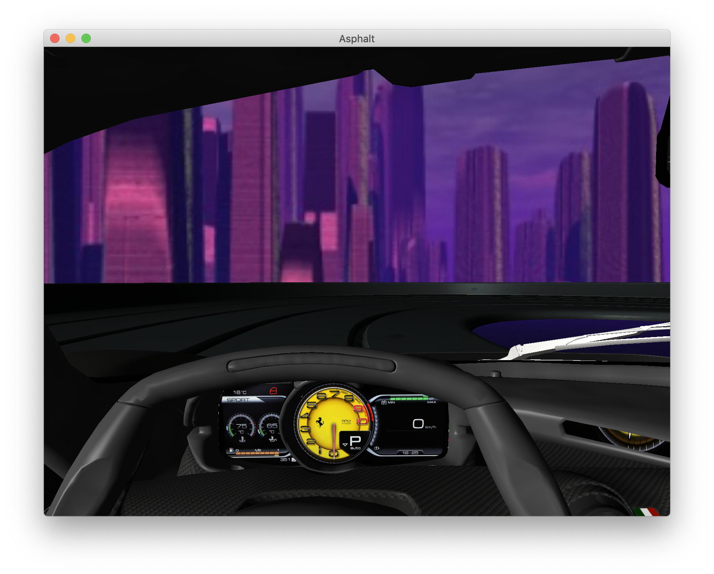
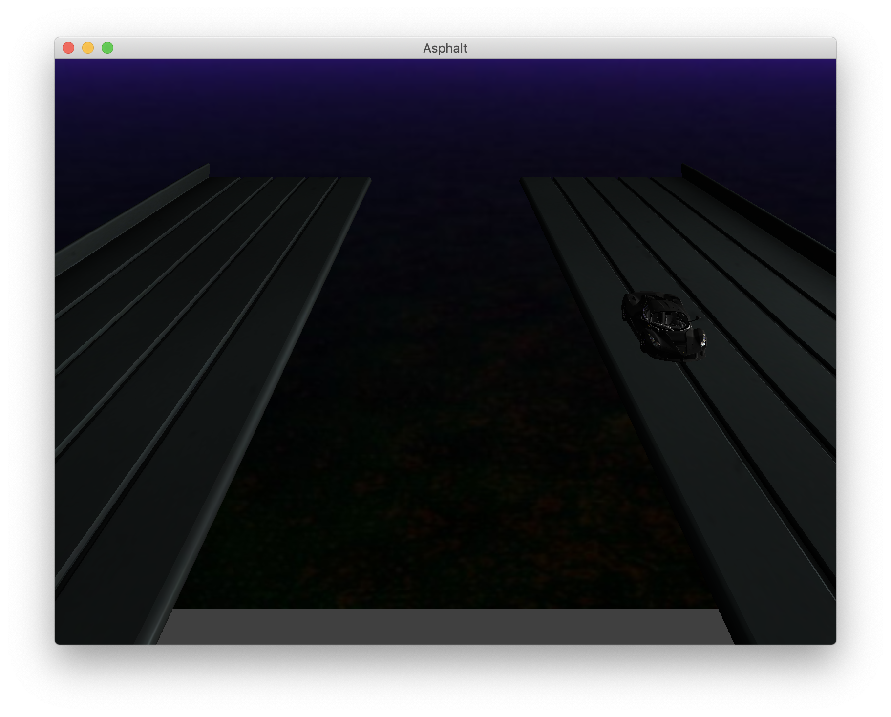
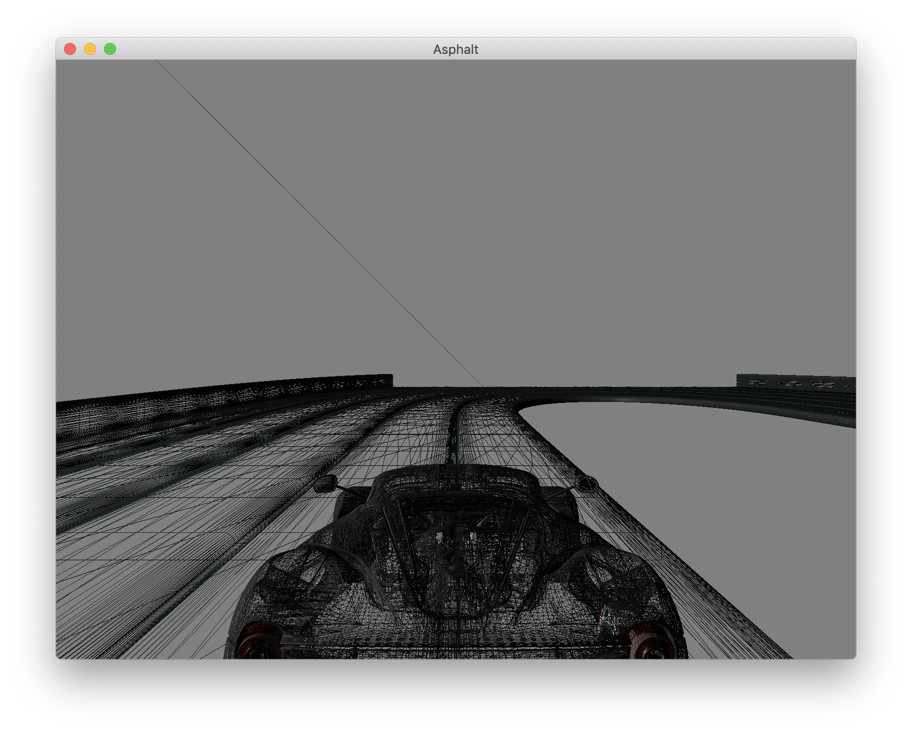

# car-race-game
 A simple car race game for lab2 of CG lesson

This is a tiny project for a CG lesson, in which I make a car game with some basic function. The project is based on GLFW and some codes are refered to [LearnOpenGL CN](https://learnopengl-cn.github.io) (With my greatest appreciation).

## screenshots

## Requirements 

* GLFW
* GLAD
* GLM
* ASSIMP

## Buttons available

Button | Function
:--:   | :--:
UP     | Go Forward
DOWN   | Go Backward
RIGHT  | Turn Right
LEFT   | Turn Left
CONTROL| Speed Up
SHIFT  | Drift
B      | Brake
T      | Change the view
L      | Line Mode
U      | Face Mode
R      | Restart

## Some tips:
1. When turning, UP/DOWN should be pressed simultaneously.
2. Acceleration time is 2s. Ones control is pressed, you can get 2 second to speed up. No need to press it all the time.
3. Brake just slows down the car. If you want to stop, release all the buttons.

## TODO
* Add a menu. I tried to use nano-gui but failed. If someone can teach me how to combine it with an existed projecct, I would be really appreciated.
* Add a shadow. I suppose there is something wrong with my race track since it generates really wired shadows.
* Record the best lap.
* More cars and more tracks.
